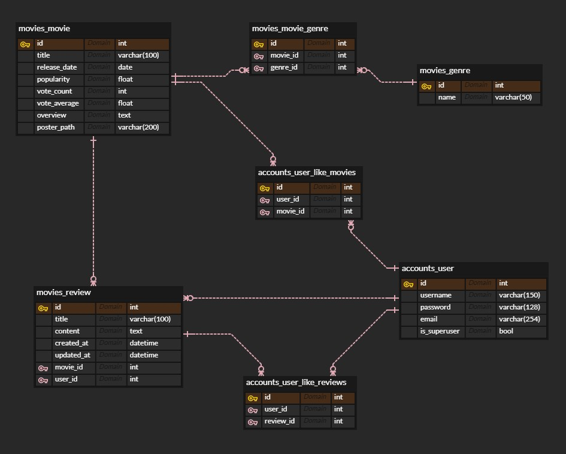
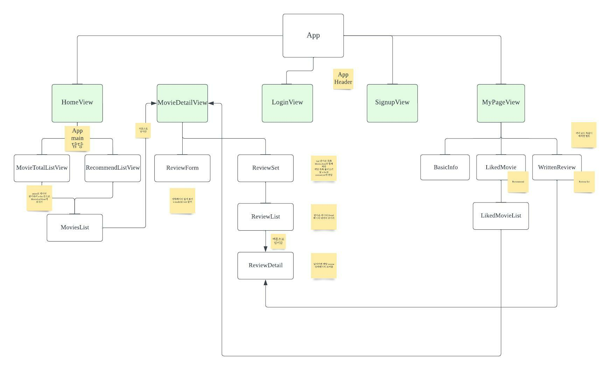
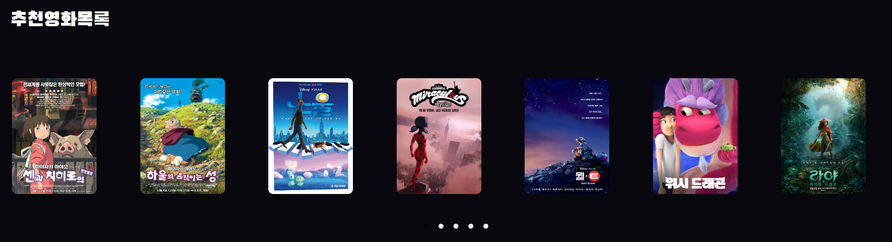
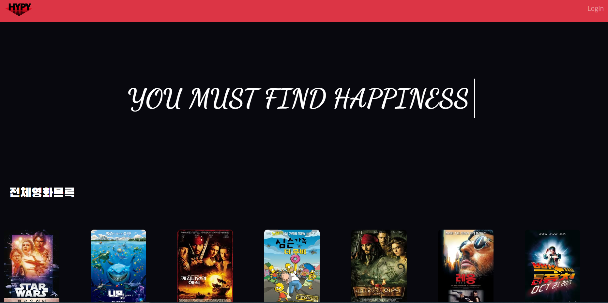
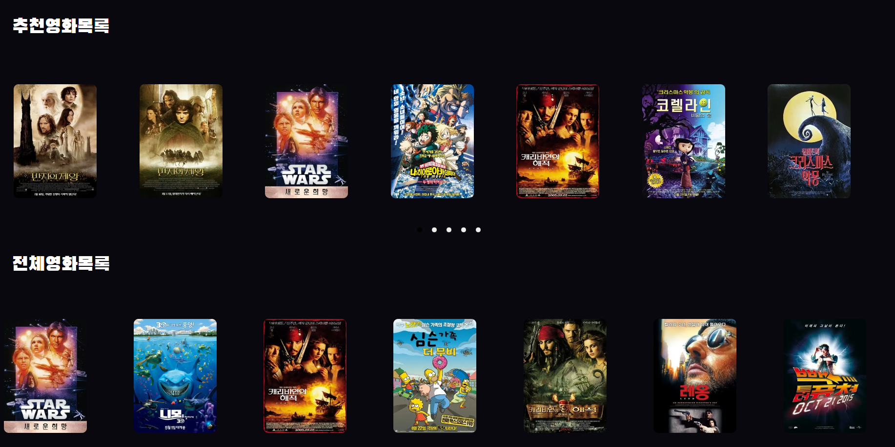
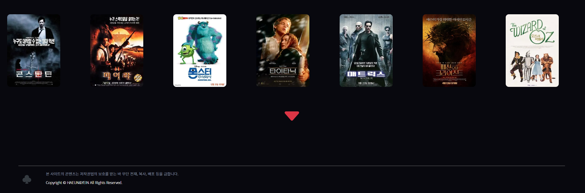
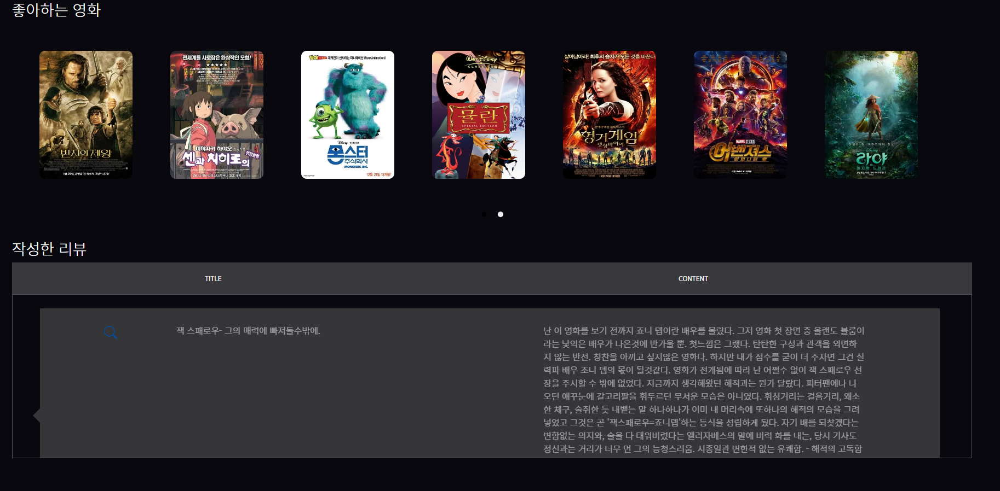
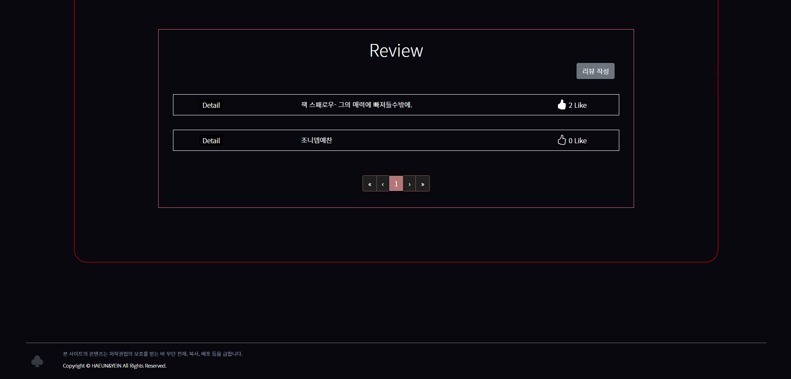

# MovieProject

# # HYPYV (Haeun Yein PYthon Vue)

- 사용자가 선호하는 영화 선택 시 코사인유사도 기반으로 유사한 영화 목록들을 추천해주는 웹 서비스입니다.

## **🧰** 사용 기술

- Python 3.9

- Django 3.2

- Node.js 16

- Vue2

## 📅 프로젝트 기간

- 2022.11.16 ~ 22.11.25

## 배포 링크

- http://hypyv.shop/

## 1. 팀원 정보 및 업무 분담 내역

**팀장 : 정예인**

- Vue 클라이언트 구현 및 배포

- Front-end

**팀원 : 류하은**

- Django를 이용한 서버 로직 구현

- Back-end

## 2. 목표 서비스 및 실제 구현 정도

**2-1. 목표 서비스** 

- 영화 추천 서비스
  
  - 유저가 좋아요한 영화를 바탕으로 코사인 유사도 기반 추천 서비스 구현
  
  - 유저가 담은 데이터는 추천 페이지에 뜨지 않도록 구현

- Community 기능
  
  - 영화 리뷰 게시판 운영
  
  - 해당 영화에 접속 시, 다른 유저가 작성한 게시판 확인 가능
  
  - 작성자는 해당 게시판 Delete 및 Modify 가능
  
  - 로그인한 회원의 경우 해당 리뷰 좋아요 기능 가능
  
  - 좋아요 순으로 리뷰 게시판 정렬 기능 구현

- 영화 조회 서비스
  
  - 해당 영화에 대한 정보 조회

- 좋아요 기능
  
  - 영화 좋아요 기능
  
  - 게시판 좋아요 기능

- 마이페이지(유저 개인 페이지)
  
  - 유저가 좋아요한 영화 확인 가능
  
  - 해당 유저가 작성한 리뷰 확인 가능 및 해당 리뷰 페이지 방문 가능

**2-2 데이터베이스 모델링(ERD)**



## 3.  프로젝트 진행 과정

**3-1. 준비 단계**

- 목표 서비스 설정
  
  - 필요한 기능, 페이지 초안 등에 관에 Component 제작



- DB 만들기
  
  - 프로젝트 영화 데이터는 TMDB 사이트에서 API Key를 통해 1000개 받아옴
  
  - 데이터를 받아올 때 사용한 코드
  
  - 영화 데이터 코드
  
  ```python
  total_data = []
  
  # 1페이지부터 10페이지까지의 데이터를 가져옴.
  for i in range(1, 11):
      # key 이용해서 데이터 가져오기
      request_url = f"<https://api.themoviedb.org/3/movie/popular?api_key={TMDB_API_KEY}&language=ko-KR&page={i}>"
      movies = requests.get(request_url).json()
      # model에 필요한 데이터 형식 지정
      for movie in movies['results']:
          data = {
              'movie_id': movie['id'],
              'title': movie['title'],
              'release_date': movie['release_date'],
              'popularity': movie['popularity'],
              'vote_count':movie['vote_count'],
              'vote_average': movie['vote_average'],
              'overview': movie['overview'],
              'poster_path': movie['poster_path'],
              'genres': movie['genre_ids']
          }
      total_data.append(data)
  ```
  
  ```python
  # 장르 데이터 코
  def get_genre_json():
  
      total_data = []
  
      # key 이용해서 데이터 가져오기
      request_url = f"https://api.themoviedb.org/3/genre/movie/list?api_key={TMDB_API_KEY}&language=ko-KR"
      movies_genre = requests.get(request_url).json()
      # model에 필요한 데이터 형식 지정
      print(movies_genre)
      for movie_genre in movies_genre['genres']:
          data = {
              'model': 'movies.genre',
              'pk': movie_genre['id'],
              'fields': {
                  'name': movie_genre['name']
              }
          }
  
  
          total_data.append(data)
  ```


## 4. 영화 추천 알고리즘

#### 유저 데이터 기반 추천

1. 로그인 하지 않은 유저
   
   - 추천 목록 컴포넌트가 보이지 않도록 한다.

2. 좋아요한 영화가 없는 유저
   
   - 추천 영화 목록을 제공하지 않는다. 
     
     

3. 좋아요한 영화가 있는 유저
   
   - 영화 추천 알고리즘을 통해, 35개의 영화 목록을 제공한다.
     
     

#### 알고리즘 설명

   1. DB 내에 저장된 영화 데이터들의 장르를 기반으로, 각 영화 간의 코사인 유사도를 분석

2. 코사인 유사도 DataFrame을 Django에서 import

3. 유저가 좋아하는 영화 data를 가져와, 각 영화들과의 코사인 유사도가 상위인 n개의 영화 추출 (총 개수 100개 가량으로 조정)

4. 100개 가량의 영화 중, vote_average가 상위인 35개 영화를 추천

```python
import pandas as pd
import numpy as np

# 코사인 유사도 상위 n개 영화 반환
def find_sim_movie(like_movie_ids, movie_ids, sorted_ind, top_n):
    recommend_movies_ids = []

    for id in like_movie_ids:
        # sorted_ind 인자로 입력된 genre_sim_sorted_ind 객체에서 코사인 유사도 순으로 top_n 개의 index 추출
        idx = movie_ids.index(id)
        similar_indexes = sorted_ind[idx, :(top_n)]
        similar_indexes = similar_indexes.reshape(-1).tolist()
        recommend_movies_ids += [movie_ids[x] for x in similar_indexes if (movie_ids[x] not in recommend_movies_ids)]

    return recommend_movies_ids

# 추천 영화 목록 조회
@api_view(['GET'])
@permission_classes([IsAuthenticated])
def movie_recommend(request):
    serializer = UserSerializer(request.user)
    like_movies_id = [movie['id'] for movie in serializer.data['like_movies']]
    print('like_movies: ', like_movies_id)

    # 유저가 찜한 영화 목록이 있는 경우
    if len(like_movies_id) > 0:
        # 1. 유저가 찜한 영화들의 장르 기반 코사인 유사도를 계산하여, 추천 영화 아이디 추출 (100개 정도)
        sim_path = 'movies/fixtures/sim_df.csv'

        sim_df = pd.read_csv(sim_path, encoding='utf-8')
        sim_df = sim_df.set_index('movie_id', drop=True)

        movie_ids = sim_df.index.tolist()

        sim_list = sim_df.values.tolist()
        sim_np = np.array(sim_list)
    
        genre_sorted_ind = sim_np.argsort()[:, ::-1]

        
        n = max(100 // len(like_movies_id), 1)
        recommend_movies_ids = find_sim_movie(like_movies_id, movie_ids, genre_sorted_ind, n)
        recommend_movies_ids = [id for id in recommend_movies_ids if id not in like_movies_id]

        # 2. 추천 영화 아이디를 가진 영화 객체 저장
        recommend_movies = []
        for id in recommend_movies_ids:
            try:
                movie = Movie.objects.get(id=id)
                recommend_movies.append(movie)
            except Exception as e:
                print(e)
                print(id)

        # 3. vote_average를 기준으로 내림차순 정렬하여 상위 35개 영화 정보 반환
        sorted_recommend_movies = sorted(recommend_movies, key=lambda movie: movie.vote_average, reverse=True)[:35]
        serializer = MovieSerializer(sorted_recommend_movies, many=True)
        return Response(serializer.data)

    
    else:
        return Response(False)
```


## 5.  웹 페이지 설명

#### 필수 기능 설명

 Frontend

- 프론트의 경우 vuex를 통해 전역으로 데이터 관리, Movie Data 및 User 정보의 경우 store에서 저장되어 관리

- 단, 영화 Detail 정보와 같이 단기적으로 필요한 정보의 경우에는 컴포넌트에서 axios 요청을 통해 받아오도록 한다.

#### 웹 서비스 목표

- 유저 좋아요 기반 추천 서비스

- 커뮤니티를 통한 유저간 소통 가능

#### 웹 페이지 화면을 통한 기능 설명

1. 로그인
   
   - 기본적인 로그인 페이지
   
   

2. 회원가입
   
   - 회원가입 페이지
   
   

3. 메인페이지

    





하단 더보기 버튼 구현

4. 마이페이지




5. 영화 세부 페이지




## 6. 느낀점

#### 정예인

SSAFY에서 한 학기동안 배운 지식을 가지고 해당 프로젝트를 진행했습니다. 하면서 다양한 오류를 잡고 여러 기능들을 구현하며 다양한 코드를 분석해보는 시간을 갖게 되어 좋았습니다.

처음부터 팀원과 Component 및 ERD를 구성하며 프로젝트의 처음과 끝을 마무리 할 수 있어서 좋았습니다.

아직까지 Vue , Django 에는 다양한 기능들이 있기에 여러 기능들을 차차 팀원과 추가해나가고 싶습니다. ㅎㅎ 

하은아 같이해줘서 고마워 ♡

#### 류하은

SSAFY에서 한 학기 동안 배운 것들을 활용하여, 웹사이트 제작을 직접 해보니 매우 뿌듯한 경험이었습니다.
특히 열심히하고 잘맞는 페어 예인이를 만나서 정말 재밌게 잘 마무리할 수 있었습니다. 갓예인 찬양합니다.
더불어, 제3의 멤버로서 함께 고군분투해주신 자룡쌤도 정말 감사드립니다.


### 페이지 내에는 행복이 숨겨져 있습니다 :)

#### 행복을 찾아보세요~~!
